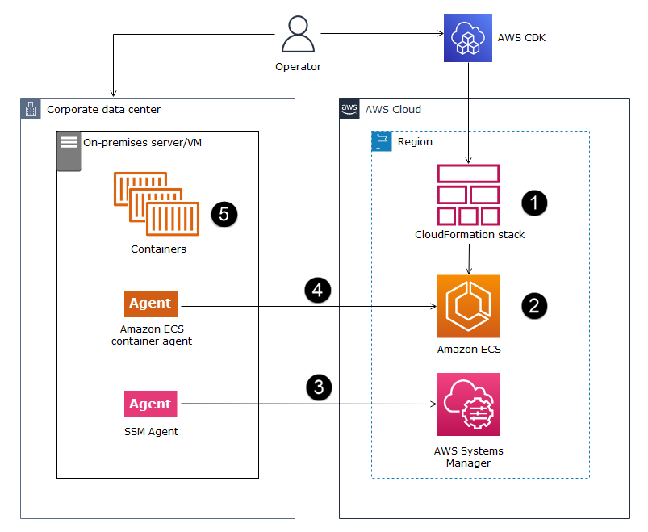

# Amazon ECS Anywhere CDK Samples

[Amazon ECS Anywhere](https://aws.amazon.com/ecs/anywhere/) enables customers to deploy native Amazon ECS tasks in on-premise or customer-managed infrastructure. It helps to reduce costs and mitigate complex local container orchestration and operations. ECS Anywhere allows you to deploy and run container applications in both on-premises and cloud environments. It removes the need for your team to learn multiple domains and skillsets and manage complex software on their own. This sample  code setup ECS Anywhere service using [AWS CDK](https://aws.amazon.com/cdk/) stacks.

## Target architecture 

## Prerequisites 

1. An active AWS account

2. AWS Command Line Interface (AWS CLI), installed and configured. For more information about this, see [Installing, updating, and uninstalling the AWS CLI in the AWS CLI](https://apg-library.amazonaws.com/content-viewer/author/3ed63c00-40e7-4831-bb9d-63049c3490aa#:~:text=Installing%2C%20updating%2C%20and%20uninstalling%20the%20AWS%20CLI%C2%A0in%20the%20AWS%20CLI) documentation. 

3. AWS Cloud Development Kit (AWS CDK) Toolkit, installed and configured. For more information about this, see [AWS CDK Toolkit (cdk command)](https://docs.aws.amazon.com/cdk/latest/guide/cli.html) in the AWS CDK documentation.

4. Node package manager (npm), installed and configured for CDK Typescript. For more information about this, see [Downloading and installing Node.js and npm](https://docs.npmjs.com/downloading-and-installing-node-js-and-npm) in the npm documentation.

## Deployment

Check out this APG Pattern for detailed deployment instructions: [Deploy Amazon ECS Anywhere using AWS CDK](https://apg-library.amazonaws.com/content-viewer/author/3ed63c00-40e7-4831-bb9d-63049c3490aa)

## Useful CDK commands

 * `npm run build`   compile typescript to js
 * `npm run watch`   watch for changes and compile
 * `npm run test`    perform the jest unit tests
 * `cdk deploy`      deploy this stack to your default AWS account/region
 * `cdk diff`        compare deployed stack with current state
 * `cdk synth`       emits the synthesized CloudFormation template
    
## Security

See [CONTRIBUTING](CONTRIBUTING.md#security-issue-notifications) for more information.

## License

This library is licensed under the MIT-0 License. See the LICENSE file.

